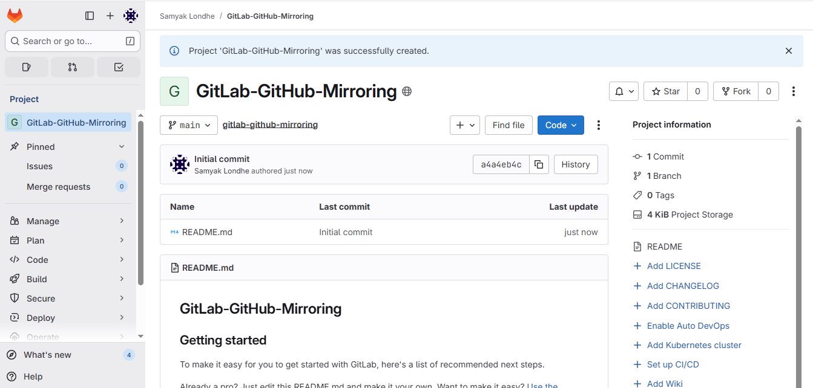
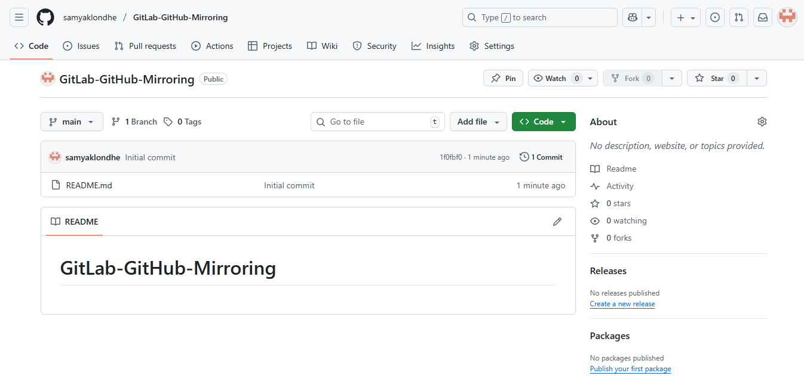
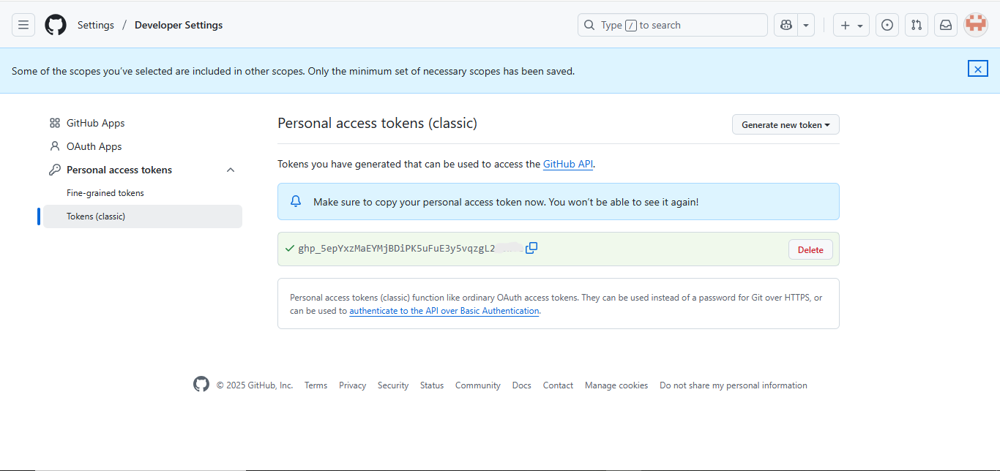
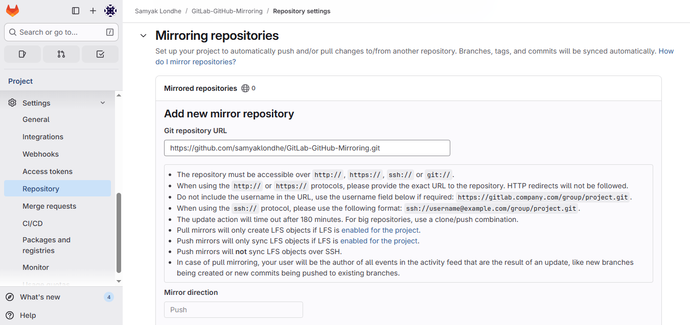
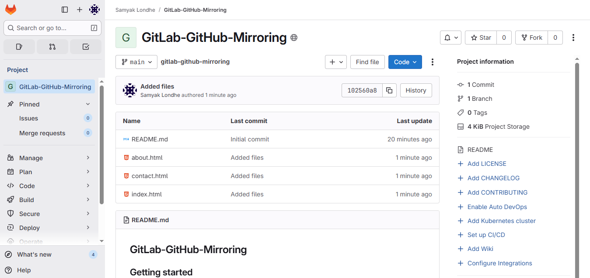
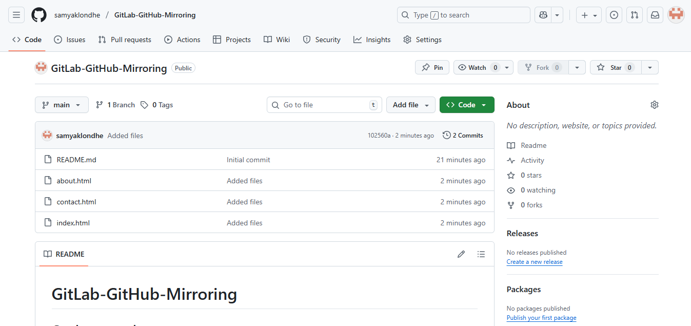

# 🔄 GitHub ↔ GitLab Repository Mirroring Demo

## 🧩 Overview
This project demonstrates how to set up **repository mirroring** between **GitLab** and **GitHub** using a **personal access token**.  
It helps in automatically synchronizing code between both platforms — a key **DevOps practice** for automation, redundancy, and multi-platform collaboration.

---

## ⚙️ Steps to Set Up Mirroring

### 1. Create Repositories
- Create a new repository on **GitLab**.  
- Create a new repository on **GitHub**.  
- Make sure both repositories use the **same branch name** (for example, `main` or `master`).

📸

---

### 2. Create Token on GitHub
1. Go to **GitHub → Settings → Developer settings → Personal access tokens → Tokens (classic)**.  
2. Click **Generate new token** and select Required permissions:
3. Copy the generated token safely — it will be used inside GitLab.

📸

---

### 3. Configure Mirroring in GitLab
1. Open your **GitLab project**.  
2. Navigate to **Settings → Repository → Mirroring repositories**.  
3. Click **Add new mirror**.  
4. In the **Repository URL**, paste your GitHub repo URL:  

5. Enter your **GitHub username**.  
6. Paste your **GitHub personal access token** in the **Password** field.  
7. Choose **Push** or **Pull** mirroring depending on your workflow.(Pull is Paid)

📸

---

### 4. Test Mirroring
- Click **Test connection** to verify that GitLab can access your GitHub repo.  
- Once successful, you’ll see a green message like **“Mirror successfully updated”**.  
- Push some code to GitLab — it should automatically sync to GitHub within a few minutes.

📸

---

✅ **Mirroring setup complete!**  
Your GitLab and GitHub repositories are now **synchronized automatically**, showcasing real-world DevOps automation.

---

## 🧠 What This Demonstrates
- Version control and repository management  
- Authentication using personal access tokens  
- Automated synchronization across platforms  
- DevOps workflow understanding  

---

## 🧑‍💻 Author
**Samyak Londhe**  
DevOps & Cloud Enthusiast  
[GitHub Profile](https://github.com/samyaklondhe) • [GitLab Profile](https://gitlab.com/SamyakLondhe)

